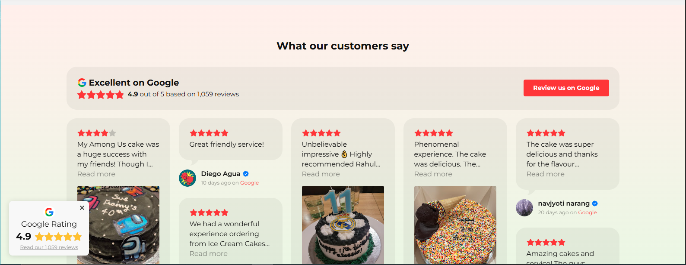

# React Elfsight Google Reviews

A lightweight React component to seamlessly embed [Elfsight](https://elfsight.com) Google Reviews widgets into your website. This package automatically injects the Elfsight platform script **only once**, even if multiple widgets are rendered on a page.

---

## ✨ Features

- 🔁 Multiple widgets support on a single page
- 🧠 Automatically lazy loads the Elfsight script
- ⚡ Fast and optimized for performance
- ✅ Safe for SSR and client-side apps (e.g., Next.js, Remix, Vite)

---

## 🔧 Installation

```bash
npm install react-elfsight-reviews
# or
yarn add react-elfsight-reviews
```

## 🔧 Prerequsite

### Create an Account on Elfsight
  - Visit Elfsight.com
  - Sign up or log in
  - Navigate to Google Reviews widget
  - Customize your widget
  - Copy the unique widget ID class (e.g. elfsight-app-12345678-xxxx-xxxx-xxxx-xxxxxxxxxxxx)

## 🚀 Usage

```
import { GoogleReviews } from 'react-elfsight-reviews';

function MyPage() {
  return (
    <div>
      <h2>What Our Customers Say</h2>
      <GoogleReviews id="elfsight-app-12345678-xxxx-xxxx-xxxx-xxxxxxxxxxxx" />
    </div>
  );
}
```
You can also pass a custom className for styling.

## Example



## 📌 Notes
- The Elfsight script is injected only once globally, even when using the component multiple times.

- This package does not include the actual review widget – it acts as a bridge to your configured widget on Elfsight.com.

- Make sure the id you pass matches exactly with the class Elfsight gives you.


